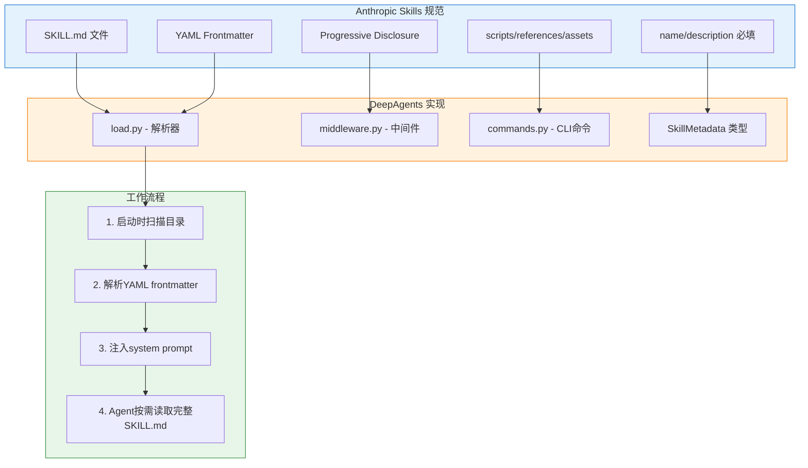
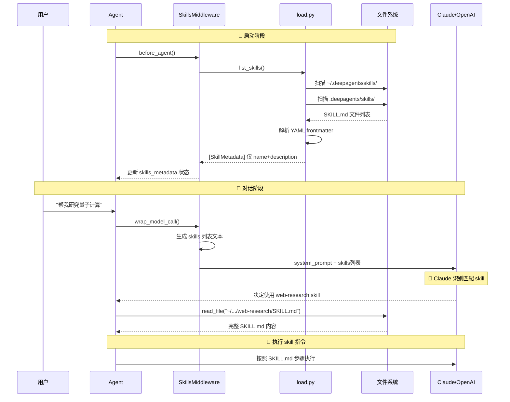
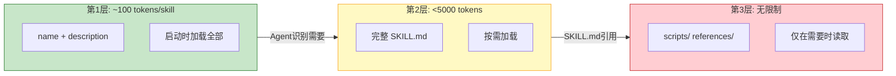
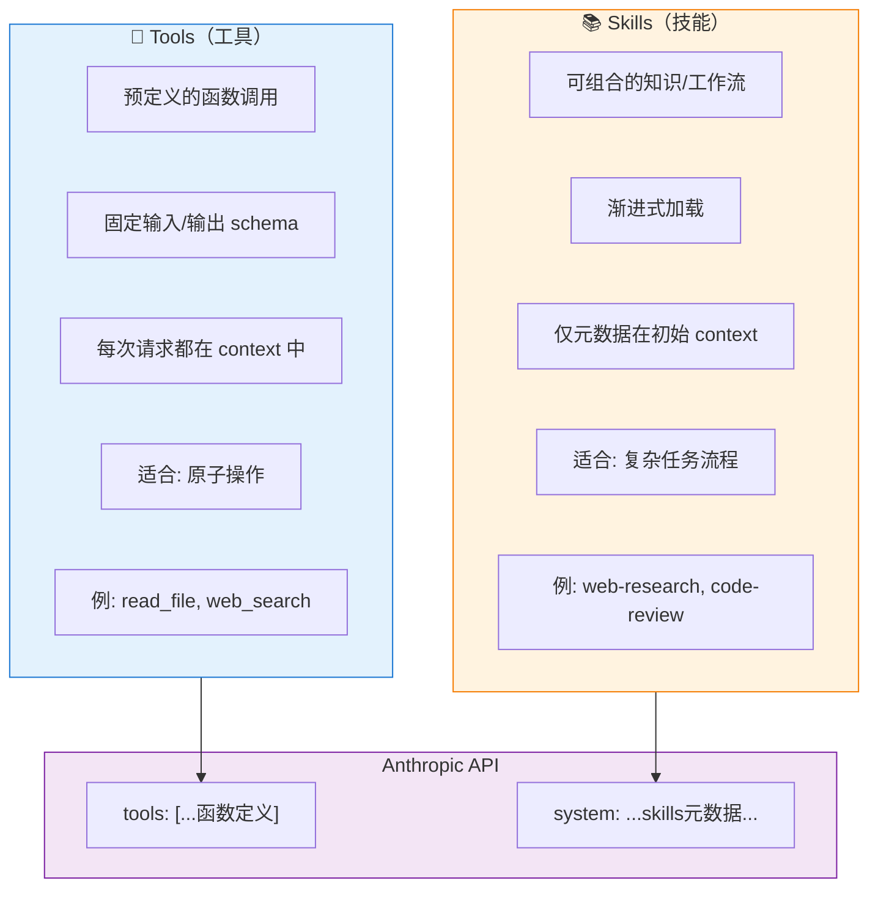

# DeepAgents CLI Skills 实现分析

## 一、Anthropic Agent Skills 规范概述

Agent Skills 是 Anthropic 于 2025年10月发布的一个**开放标准**（2025年12月18日公开为跨平台标准）。

### 1. 核心规范

**SKILL.md 文件结构**：

```markdown
---
name: web-research                    # 必填：最大64字符，小写字母+连字符
description: 结构化网络研究方法         # 必填：最大1024字符
license: Apache-2.0                   # 可选：许可证
compatibility: 需要 git, docker       # 可选：环境要求（最大500字符）
metadata:                             # 可选：自定义键值对
  author: my-org
  version: "1.0"
allowed-tools: Bash(git:*) Read       # 可选：预批准工具列表
---

# Web Research Skill

## 详细说明和工作流程...
（Markdown正文内容）
```

### 2. 目录结构规范

```
skill-name/
├── SKILL.md           # 必需：YAML frontmatter + 指令
├── scripts/           # 可选：可执行脚本
├── references/        # 可选：参考文档
└── assets/            # 可选：静态资源
```

## 二、当前项目对 Anthropic Skills 规范的实现

**本项目完整实现了 Anthropic 的 Agent Skills 规范！**

### 实现架构图



### 实现对照表

| Anthropic 规范要求 | 项目实现 | 代码位置 |
|---|---|---|
| name 字段（最大64字符） | ✅ `MAX_SKILL_NAME_LENGTH = 64` | `load.py:41` |
| description 字段（最大1024字符） | ✅ `MAX_SKILL_DESCRIPTION_LENGTH = 1024` | `load.py:42` |
| YAML frontmatter 解析 | ✅ `yaml.safe_load()` | `load.py:174` |
| 目录结构验证 | ✅ `_is_safe_path()` | `load.py:74-111` |
| name 格式验证 | ✅ 小写字母+连字符 | `load.py:114-140` |
| 可选字段支持 | ✅ license, compatibility, metadata, allowed-tools | `load.py:61-71` |
| 渐进式披露 | ✅ SkillsMiddleware | `middleware.py:102-278` |

### 项目文件结构

```
deepagents_cli/skills/
├── __init__.py
├── load.py           # SKILL.md 解析器，YAML frontmatter 提取
├── middleware.py     # LangChain 中间件，注入 skills 到 system prompt
└── commands.py       # CLI 命令：list, create, info
```

## 三、Skills 动态加载流程

### 流程时序图



### 启动阶段

1. **Agent 启动** → 调用 `SkillsMiddleware.before_agent()`
2. **扫描目录** → `list_skills()` 扫描用户级和项目级 skills 目录
3. **解析元数据** → 仅提取 YAML frontmatter 中的 `name` 和 `description`
4. **存储状态** → 将 `SkillMetadata` 列表保存到 agent state

### 对话阶段

1. **用户发送消息** → Agent 调用 `wrap_model_call()`
2. **注入 skills 列表** → 将 skills 元数据格式化后追加到 system prompt
3. **LLM 识别匹配** → Claude/OpenAI 根据任务匹配相关 skill
4. **按需加载** → Agent 使用 `read_file` 工具读取完整 SKILL.md
5. **执行指令** → 按照 SKILL.md 中的步骤执行任务

## 四、渐进式披露 - 减少上下文的核心机制

### 三层披露结构图



### 三层披露结构

| 层级 | 内容 | Token 消耗 | 加载时机 |
|---|---|---|---|
| 第1层 | name + description | ~100 tokens/skill | 启动时全部加载 |
| 第2层 | 完整 SKILL.md | <5000 tokens | Agent 按需加载 |
| 第3层 | scripts/ references/ | 无限制 | 仅在需要时读取 |

### 上下文节省对比

假设有 10 个 skills，每个完整 SKILL.md 约 3000 tokens：

| 方式 | System Prompt | 按需加载 | 总消耗 |
|---|---|---|---|
| 无 Skills（全部塞入） | 30,000 tokens | - | 30,000 tokens |
| 有 Skills（渐进式） | 1,000 tokens | 3,000 tokens | 4,000 tokens |
| **节省** | | | **87%** |

## 五、对照 Anthropic Messages API 请求体

### 传统方式（无 Skills）

```json
{
  "model": "claude-sonnet-4-20250514",
  "max_tokens": 4096,
  "system": "你是一个助手...\n\n[10个完整skill内容 = 30,000 tokens]",
  "messages": [
    {"role": "user", "content": "帮我研究量子计算"}
  ]
}
// system prompt 消耗 ~30,000 tokens ❌
```

### 渐进式披露方式（使用 Skills）

**第一轮请求 - 只有元数据：**

```json
{
  "model": "claude-sonnet-4-20250514",
  "max_tokens": 4096,
  "system": "你是一个助手...\n\n## Skills System\n\n**Available Skills:**\n- **web-research**: 结构化网络研究方法\n  → Read `/path/to/SKILL.md` for full instructions\n- **arxiv-search**: 搜索学术论文...\n[10个 name+description = ~1000 tokens]",
  "messages": [
    {"role": "user", "content": "帮我研究量子计算"}
  ]
}
// system prompt 仅 ~1,000 tokens ✅
```

**第二轮请求 - Agent 决定读取 skill：**

```json
{
  "model": "claude-sonnet-4-20250514",
  "messages": [
    {"role": "user", "content": "帮我研究量子计算"},
    {
      "role": "assistant",
      "content": null,
      "tool_calls": [
        {"name": "read_file", "arguments": {"path": "~/.deepagents/skills/web-research/SKILL.md"}}
      ]
    },
    {"role": "tool", "content": "[完整 SKILL.md 内容 = 3000 tokens]"}
  ]
}
// 仅加载需要的 1 个 skill ✅
```

## 六、Skills vs Tools - 本质区别

### 对比架构图



### 对比表格

| 特性 | Tools | Skills |
|---|---|---|
| **在 API 请求中的位置** | `tools` 数组 | `system` prompt |
| **上下文消耗** | 每个 tool 定义都算 tokens | 仅 name+description |
| **加载时机** | 始终加载 | 按需加载 |
| **功能类型** | 原子操作（函数） | 复杂工作流（知识） |
| **可扩展性** | 受 context 限制 | 几乎无限 |
| **使用方式** | LLM 直接调用 | LLM 先读取，再按指令执行 |

**Skills 并非替代 Tools，而是补充！** Skills 实际上会**引导 Agent 如何更有效地使用 Tools**。

## 七、项目代码实现关键点

### SkillMetadata 类型定义

```python
# load.py
class SkillMetadata(TypedDict):
    """Metadata for a skill per Agent Skills spec."""

    name: str                              # 必填
    description: str                       # 必填
    path: str                              # SKILL.md 文件路径
    source: str                            # 'user' 或 'project'
    license: NotRequired[str | None]       # 可选
    compatibility: NotRequired[str | None] # 可选
    metadata: NotRequired[dict | None]     # 可选
    allowed_tools: NotRequired[str | None] # 可选
```

### SkillsMiddleware 核心逻辑

```python
# middleware.py
class SkillsMiddleware(AgentMiddleware):
    """Middleware for loading and exposing agent skills."""

    def before_agent(self, state, runtime):
        """启动时加载 skills 元数据"""
        skills = list_skills(
            user_skills_dir=self.skills_dir,
            project_skills_dir=self.project_skills_dir,
        )
        return SkillsStateUpdate(skills_metadata=skills)

    def wrap_model_call(self, request, handler):
        """每次模型调用时注入 skills 到 system prompt"""
        skills_metadata = request.state.get("skills_metadata", [])
        skills_section = self.system_prompt_template.format(
            skills_locations=self._format_skills_locations(),
            skills_list=self._format_skills_list(skills_metadata),
        )
        return handler(request.override(
            system_prompt=request.system_prompt + "\n\n" + skills_section
        ))
```

### Skills 目录位置

- **用户级**: `~/.deepagents/{AGENT_NAME}/skills/`
- **项目级**: `{PROJECT_ROOT}/.deepagents/skills/`
- **优先级**: 项目级 skills 会覆盖同名的用户级 skills

## 八、总结

本项目**完整实现了 Anthropic Agent Skills 规范**，核心价值在于：

1. **渐进式披露**：只在 system prompt 中放入 skill 元数据（~100 tokens/skill），完整内容按需加载
2. **上下文优化**：相比将所有知识塞入 prompt，可节省 80%+ 的 token 消耗
3. **可扩展性**：技能数量几乎不受 context window 限制
4. **与 Tools 协作**：Skills 教 Agent 如何高效使用 Tools 完成复杂任务

## 参考资料

- [Agent Skills 官方规范](https://agentskills.io/specification)
- [Anthropic 官方博客：Equipping agents for the real world with Agent Skills](https://www.anthropic.com/engineering/equipping-agents-for-the-real-world-with-agent-skills)
- [Claude Docs: Agent Skills](https://platform.claude.com/docs/en/agents-and-tools/agent-skills/overview)
- [Anthropic Skills GitHub](https://github.com/anthropics/skills)

